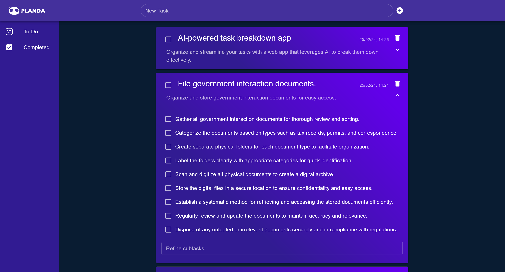

# Planda
Planda is an AI-Powered Task Management Application that aims to alleviate the most difficult part of any task - starting! Planda allows you to place an entry on your to-do list and uses a Large Language Model to analyse and break it down into more manageable sub-tasks. This means that instead of being overwhelmed and procrastinating the items on your agenda, you can use Planda to alleviate the difficulty of structuring your tasks by ticking off the easier sub-tasks to track your progress.

## This repository contains the code for Planda's frontend functionality
To run this code, you need to clone the repository, then open up a terminal inside the repository and execute `npm install` to install all necessary dependencies. You can then use `npm start` to run the application.

_Planda was made by a team of Third Year Computer Science students over the course of a single weekend during the Hack Trinity event of 2024._
